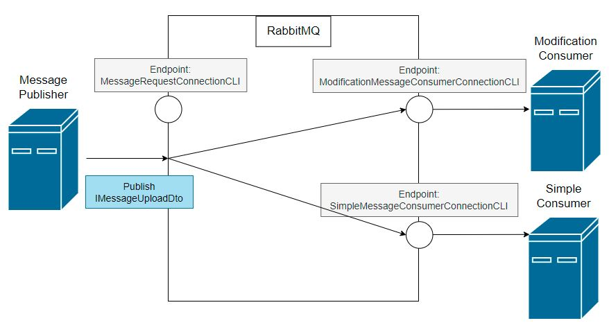
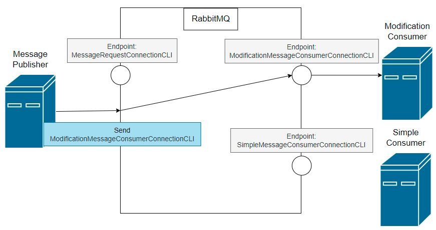
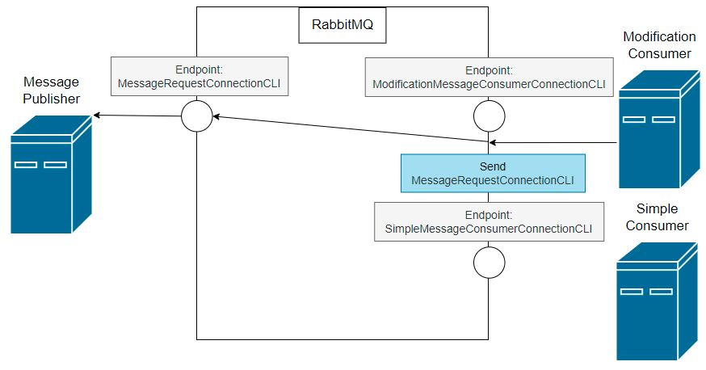

# CLI Communication with RabbitMQ and MassTransit.

This project is an example of simple communication between 3 CLI Projects.
 
Solution contains 4 projects -
 
- MessageCliCommunication.Contract - contains shared configuration, models, etc
- MessagePublisher - publish messages that is written by user in command line
- SimpleMessageConsumer - outputs received messages
- ModificationMessageConsumer - outputs received messages, and sends modification requests if received message starts or ends with whitespace. If a message starts with whitespace it should be modified for everyone. If a message ends with whitespace and doesn't start with whitespace, it should be modified only for the ModificationMessageConsumer project.
 
Configuration:
- MessageCliCommunication.Contract/masstransitSharedConfig.json - contains credentials, host, port and virtual scheme of RabbitMQ server. Additionally contains name of endpoint that will be used for modification.
- SimpleMessageConsumer/appsetting.json and ModificationMessageConsumer/appsetting.json contain names of queues for received messages.
 
Communication diagrams -
 
- Message publishing

 
- Modify request

 
- Modify response for everyone

 
- Modify response only for ModificationMessageConsumer
